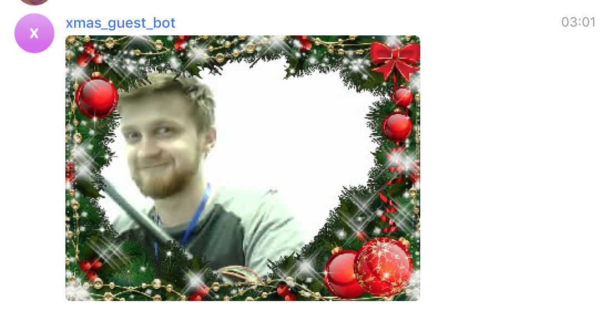
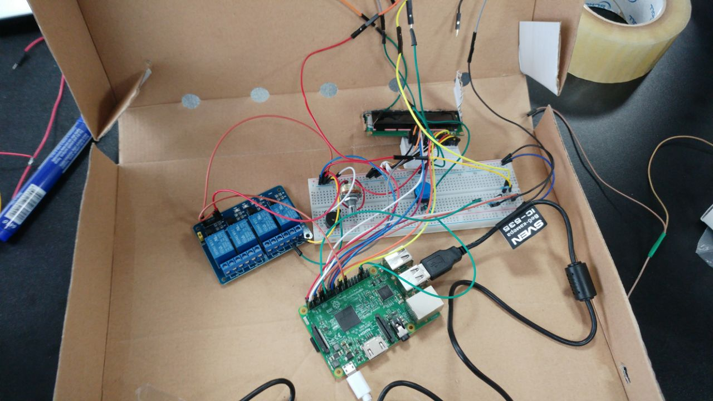
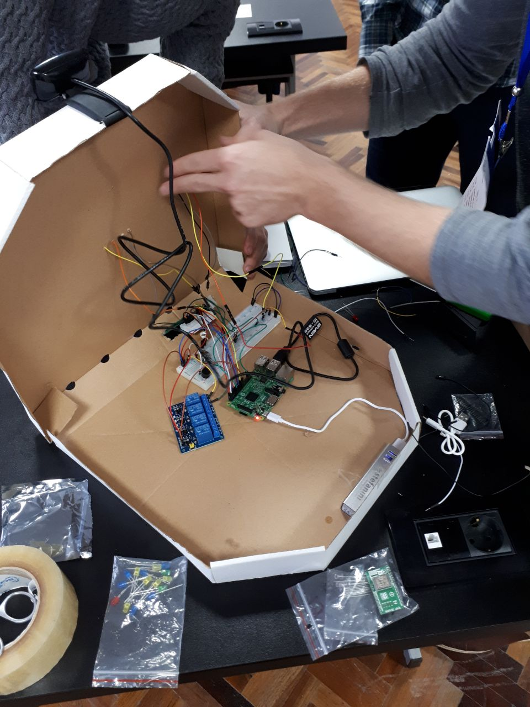

# Christmas Hackathon - Internet of things

## Description

In this hackathon we worked on a home assistant. We developed a product for people who are often not home or are too busy to open the door. The device represents an enhanced doorbell with a camera and a microphone, 2 buttons, as well as an LCD display. It is connected to a Telegram Bot which can be added to a chat.

## Functionalities
  1. When the first button is pressed, an image of the guest is sent to the chat. It also produces a short buzz sound.
  

  2. When the second button is held, it records an audio, which is then sent to the chat as an Audio Message.
  

#### Commands
  1. `/start` - starts the Bot
  2. `/photo` - immediately takes a photo
  3. `/collage [time=<int>]` - makes a Collage (gif) of all the captured images in the last 30 minutes, unless a specific `n` minutes is given
  4. `/send <text>` - send a text to the LCD display

## Composition

  1. Raspberry Pi 3
  2. Webcam with integrated microphone
  3. Buzz thing
  4. USB battery
  5. Buttons x2
  6. LEDs x2
  7. LCD Display
  8. Pizza Box
  9. Cables...

We used the WiFi capabilities of RaspberryPi3

## Useful commands
* Run Raspberry Pi 3 ssh: `ssh pi@<raspberry_pi_ip>`
* Run Raspberry Pi 3 ssh with rsub support: `ssh pi@<raspberry_pi_ip> -R 52698:localhost:52698`
